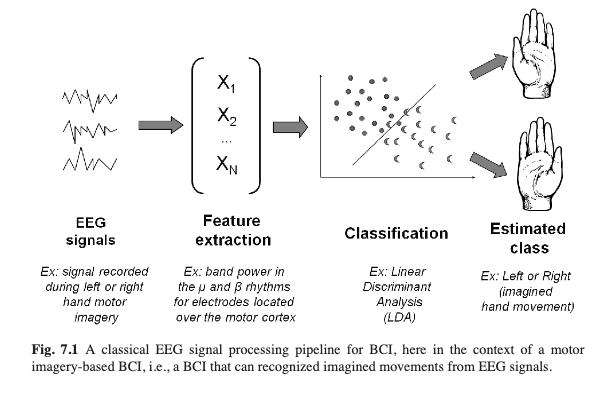

# Decoding EEG-Based Movement Imagery (MI) using a CNN-Transformer
_by Antonia Reul (2026)_

This project attempts to develop a CNN-Transformer, combining scientific techniques which have proven highly useful in research the past couple of years, which can decode movement imagination from EEG data reliably.

## Setup
The MNE library, as well as other medical libraries, are still getting upgraded and sometimes use older code versions. To ensure the code works, the following installations are recommended:

* python = 3.10 - MNE is more stable on it than on 3.12
* numpy < 2.0 - MNE relies on a function which has been removed and renamed in NumPy2.0
* scipy >= 1.11 

    Users are encouraged to ensure a proper running of the 'pipeline_test.ipynb' to make sure, the main code can be properly executed.
    

## Literature Background
##### Brain Computer Interfaces (BCIs)
Brain Computer Interfaces (BCIs) enable the control of external devices or systems solely through measured brain activity (Liao et al., 2025). BCIs can therefore be used for prosthetic limb operations or in stroke patient mobilization (Liao et al., 2025). A promising BCI application, which inspired this project, is an EEG-based BCI for limb movement based on movement imagination, for instance for patients with phantom limbs. 

BCIs typically first acquire data from either noninvasive skull measurements, using EEG, or invasive methods like ECoG. The signals are then processed, relevant features extracted, classified and the feedback is then used to optimize the procedure. Especially in spinal cord injuries, where the communication of muscle spindles with higher cognitive areas is impaired, represents a motivation to work on such devices. 

##### Deep Learning and BCIs
Different deep learning (DL) models have been applied to decode movement imagination (MI), among those being CNNs, RNNs, LSTMs and GRUs, as well as Transformers. While CNNs are good at local feature extraction, they struggle with global information. For Transformers, the opposite is the case: Since they have no inductive local bias, they require large datasets to converge. However, EEG data is typically quite scarce and hence a Transformer might potentially overfit the data. 

##### Challenges of EEG Data
EEG data is usually highly variable, non-stationary, typically scarce, and has a low signal-to-noise ratio (Liao et al., 2025). To tackle those challenges, research has focused on CNN-Transformers in recent years, combining the local strength of CNNs with global focus of a Transformer.

## Project
The project aims to build on Ma et al. (2022) and Liao et al. (2025), but inspiration from further recent scientific papers and publications has been drawn to improve the model's accuracy as well.

### The Dataset
The EEG Motor Movement/Imagery Dataset by Schalk (2009) is one of the standard BCI datasets commonly used in the field, besides the BCI Competition IV 2a dataset. The dataset contains a set of 64-channel EEGs from participants performing motor/imagery tasks. Since the python MNE library for EEG preprocessing provides access to it, it is very comfortable for application. Further descriptions and plots about the dataset can be found in 'notebooks/datapreprocessing.ipynb'.

### The Architecture
1. EEG Data Preprocessing
* Feature extraction
* Spectrogram generation & fusion of spectrograms for input to CNN
2. CNN for capturing local dependencies
* Temporal Convolutions: extract local rhythms & waveforms - the kernel is moving across time
* Spatial Convolutions: capture channel interactions - the kernel is moving across electrodes
3. Pooling/Downsampling
4. Permutation
5. Transformer-Encoder for capturing global dependencies
6. MLP Classifier

#### Preprocessing
_The knowledge of the following passage is based on the "Introduction to EEG-preprocessing" chapter in the section "Data analyses" in the book by Herholz et al. (2020)_

To work with the raw EEG data, it should be transformed into a more suitable format via preprocessing. During the procedure, one can already perform filtering or artifact removal, and normalization might help achieve a better comparability of EEG signals, which can be helpful when the EEG is measured in different subjects with different baselines. As previously highlighted, EEG data is quite noisy and signals from the scalp are not necessarily accurately representing signals coming from the brain. Even eye blinks, muscle movements and other neural activity might distort the EEG signal, contaminating the data as highlighted by Kavira & Vinjamuri (2025) among others. Therefore preprocessing can help get closer to the "true" neural signal, before actually letting the CNN discover local and the Transformer global dependencies. Some preprocessing measures implemented in this project include:
* band-pass filtering
* artifact removal via ICA
* normalization

For the coding and actual application, the MNE python library (https://mne.tools/dev/auto_tutorials/intro/10_overview.html) has been used and inspiration drawn from Silvera (2022).

It is important to notice that preprocessing is **only applied to the training dataset**! (see below an exemplary BCI signal processing pipeline)

_Image adapted from Lotte (2014)_

#### The VAE and the CNN part of it
Instead of using an MLP-Encoder in the VAE, a CNN is used, from which the mean and standard deviation can then get determined, used to sample a latent representation. To complete the architecture, the decoder is composed of Convolutional transpose layers so that local temporal and spatial EEG features can be learned.

(!! not used anymore !!)
The Convolutional Layers can be split into a temporal and a spatial CNN, with the temporal detecting local rhythms and waveforms (kernel moved across time) and the spatial detecting channel interactions (kernel is moving across electrodes). In the *CNN* a dropout ratio of 0.3 and weight decay of 0.5 are used, to prevent overfitting (inspired by Liao et al. (2025)).

#### Before Input can pass on to the Transformer ...
... pooling is applied to shorten the sequences and save computation power. Furthermore, the Transformer expects the tensors to have the shape (Batch, Time Samples, Embeddings), and not (Batch, Embeddings, Time Samples), so permutation is applied to the CNN output.

Theoretically, positional encoding can also be applied, however, literature is in dispute whether it makes a difference, given that convolutional layers already detect local dependencies, or not.

#### The Transformer-Encoder
The *Transformer* is built on an attention layer and feed-forward network, followed by a normalization layer and a swish gated linear unit (SwiGLU) as activation function, which has proven very useful in the paper from Liao et al. (2025).

#### The MLP Classifier
The global average and CLS tokens aka the learned representations from the transformer finally need to get mapped to the available classes, so that finally, one label can be predicted as the output. This is done by a final multilayer perceptron (MLP) classifier.

### Training
Instead of training the full Transformer-architecture on the EEG data directly, a compact latent representation is learned in a VAE encoder-decoder architecture that is trained end-to-end first. The decoder component of that architecture is then ignored and for the further use, only the encoder part will be used to produce the latent compressions fed into the Transformer, which can then be trained on the embeddings of the VAE. This idea is inspired by Wolff (2025) and also through a personal conversation with the author. ChatGPT has been used for further questions. To not continuously require the Encoder model nor the raw data for the sampling of the latent representation z, previously calculated embeddings are saved as a memmap in DuckDB (also inspired by Wolff (2025)). DuckDB enables working very easily with the stored data embeddings instead of the raw data without having to work with indices. For higher efficiency, Memmap (.npy file) can be used for the embeddings for each label to avoid too many SQL-queries and enable direct array access instead.

The training is therefore split into two phases:

* Phase 1: EEG data -> CNN Encoder -> mu, sigma -> sampling to get latent 128-d vector representation z -> CNN Decoder -> EEG data reconstruction
_now the decoder part gets ignored_
* Phase 2: Input -> CNN Encoder (freeze) -> mu -> PosE -> Transformer -> pred

**Forward Pass**: The input is first passed through the CNN, then Transformer and finally classified. One can then compute the loss, which I do using the categorical cross entropy with label smoothing (again inspired by Liao et al. (2025)). 
**Backward Pass**: The loss is then backpropagated through the network to calculate the gradients of the loss function with respect to the weights and biases. 
**Weight Update**: The computed gradients from the backward pass are then used to update the network's parameters using the optimization algorithm Adam:

### Evaluation
As *Validation* matrices, accuracy, the amount of correctly classified samples, and Cohen's kappa are used. Cohen's kappa is especially useful for scenarios with imbalanced data distributions (Liao et al., 2025). To compare the classification results for my model to other state-of-the-art models, confusion matrices have been computed ()

#### Limitations
Gao & Diniz (2026) demonstrated that the EEG decoding architecture inductive bias might matter more than the raw data volume, illustrating the importance of a good architectural choice.

#### Extensions / Discussion
Nice extensions for this project could be using a Temporal Convolutional Network (TCN) as Liao et al. (2025) for time-series modeling and capturing nuanced temporal dynamics. To handle data nonstationarity, multivariate empirical mode decomposition (MEMD) could also improve the model's results potentially (Liao et al., 2025). Further, Kaviri & Vinjamuri (2025) have illustrated the high potential of source localization techniques, like beaqm forcing, to compare accuracy scores. Another extension could be applying Grad-CAM or gate-weight analyses which links prediction to oscillatory bands for interpretation, as done by Gao & Diniz (2026), who also suggest implementing zero-shot transfer learning. Besides that, spherical positional encoding, as suggested by Yuce & Stober (2026), could represent a fruitful extension.

### References
* Gao, Y., & Diniz, J. M. (2026). From perception to imagination: a robust deep learning architecture for real-time EEG decoding and neurophysiological validation. Computer Methods in Biomechanics and Biomedical Engineering: Imaging & Visualization, 14(1). https://doi.org/10.1080/21681163.2026.2684109.
* Herholz, P., García Alanis, J. C., & Vogelbacher, C. (2020). Methodological work in the neurosciences. GORELLA project. https://g0rella.github.io/gorella_mwn/index.html. 
* Kaviri, S. M., & Vinjamuri, R. (2025). Decoding motor execution and motor imagery from EEG with deep learning and source localization. Biomedical Engineering Advances,
9, 100156: 2667-0992.https://doi.org/10.1016/j.bea.2025.100156.
* Liao, W., Liu, H. & Wang, W. (2025). Advancing BCI with a transformer-based model for motor imagery classification. Sci Rep 15, 23380. https://doi.org/10.1038/s41598-025-06364-4. - the code is available here: https://github.com/BlackCattt9/EEGEncoder
* Lotte, F. (2014). A Tutorial on EEG Signal Processing Techniques for Mental State Recognition in Brain-Computer Interfaces. Eduardo Reck Miranda; Julien Castet. Guide to Brain-Computer Music Interfacing, Springer, 2014. ⟨hal-01055103⟩. https://inria.hal.science/hal-01055103v1/document.
* Ma, Y., Song, Y. & Gao, F. (2022). A novel hybrid CNN-Transformer model for EEG Motor Imagery classification. International Joint Conference on Neural Networks (IJCNN), Padua, Italy, 2022, 1-8. https://doi.org/10.1109/IJCNN55064.2022.9892821.
* Schalk, G. (2009). EEG Motor Movement/Imagery Dataset (version 1.0.0). PhysioNet. RRID:SCR_007345. https://doi.org/10.13026/C28G6P - documentation: https://physionet.org/content/eegmmidb/1.0.0/
* Silvera, D. G. (2022). Brain-Computer Interfaces (BCIs) for Motor Imagery Classification. https://github.com/DavidSilveraGabriel/EEG-classification/tree/master. 
* Wolff, C. (2025). Efficient Data Loading for Meta In-Context Learning using DuckDB (unpublished). 
* Yuce, A. B., & Stober, S. (2026). Benchmarking Positional Encoding Strategies for Transformer-Based EEG Foundation Models [Arxiv Preprint].     
https://doi.org/10.48550/arXiv.2605.29754.
